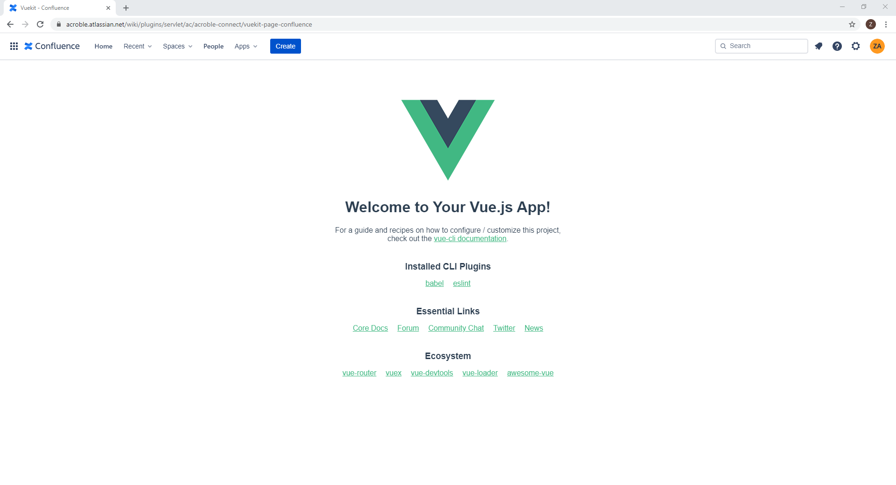

# acroble-connect
# Spring Boot and Vue.js with Atlassian Confluence #

## Usage ##

1. ngrok http 8081

2. Change urls in these files to https url from ngrok

    [vue.config.js](frontend/vue.config.js)
    
    [application.properties](backend/src/main/resources/application.properties)

3. mvn spring-boot:run

4. Access the https url. If url returns the contents of [atlassian-connect.json](backend/src/main/resources/atlassian-connect.json), then you are ready to upload the app to Atlassian.

5. Upload app via url to your Atlassian instance. See [here](https://confluence.atlassian.com/upm/installing-add-ons-273875715.html#InstallingMarketplaceapps-Installingbyfileupload)

6. Access your app from Atlassian --> Top Nav Bar --> Apps --> VueKit

7. Profit